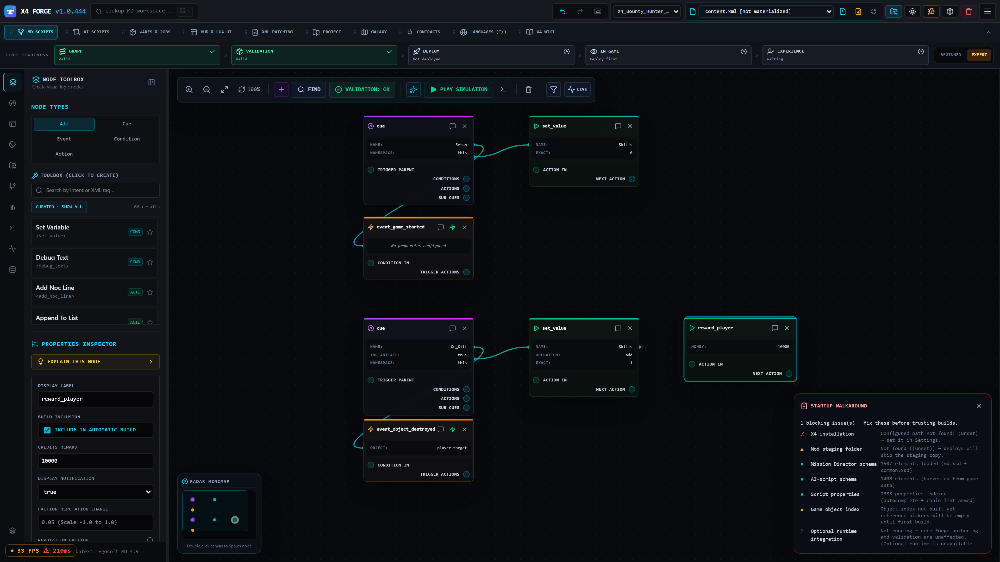
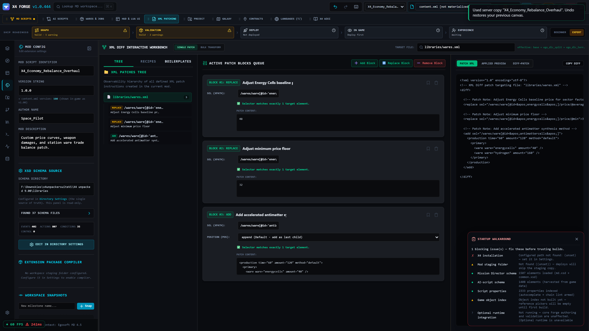
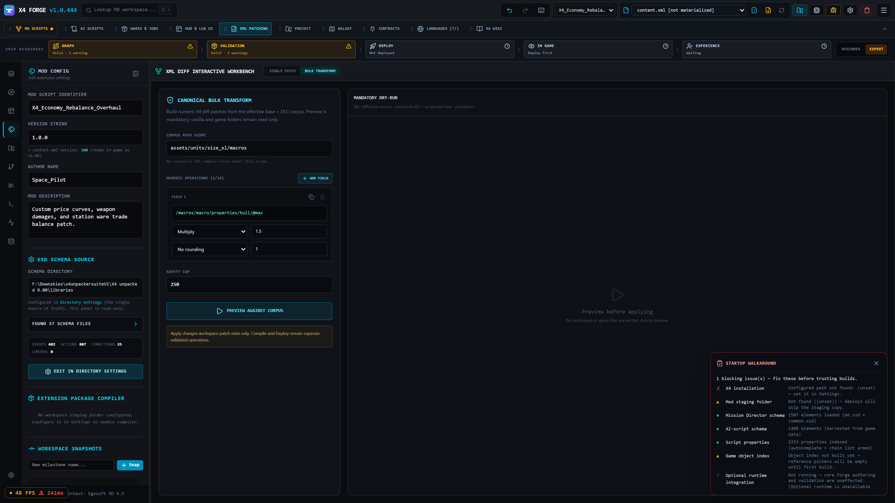
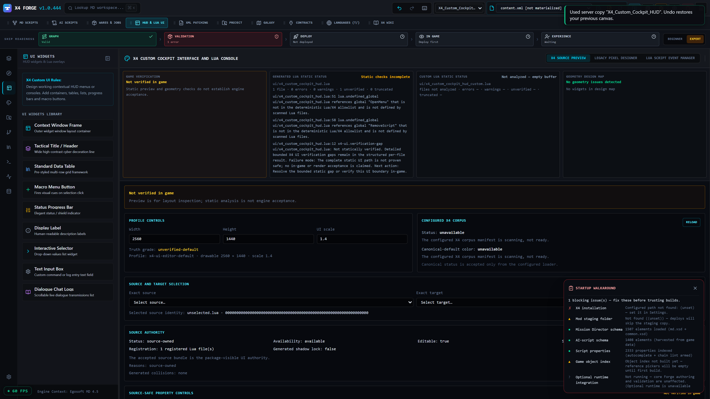
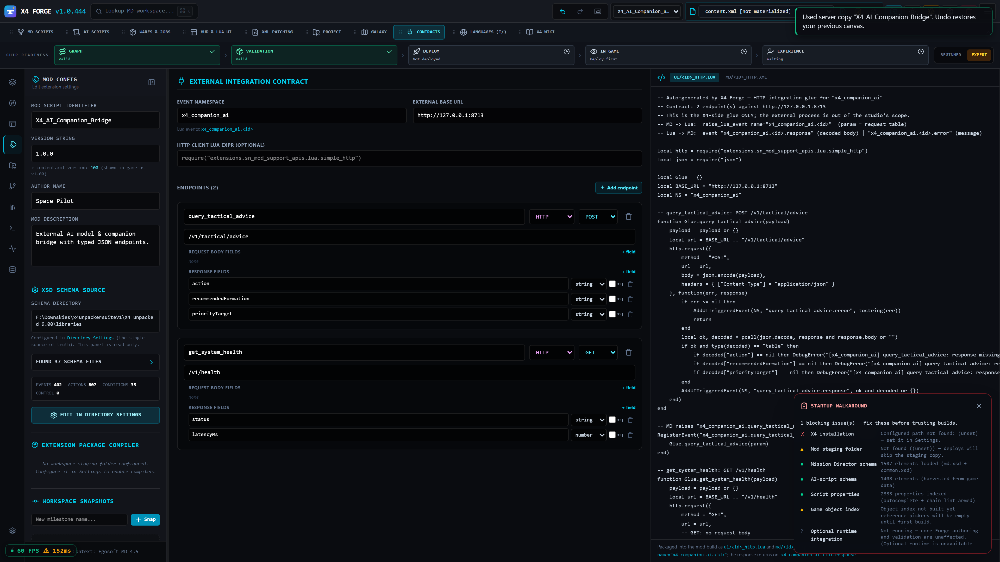
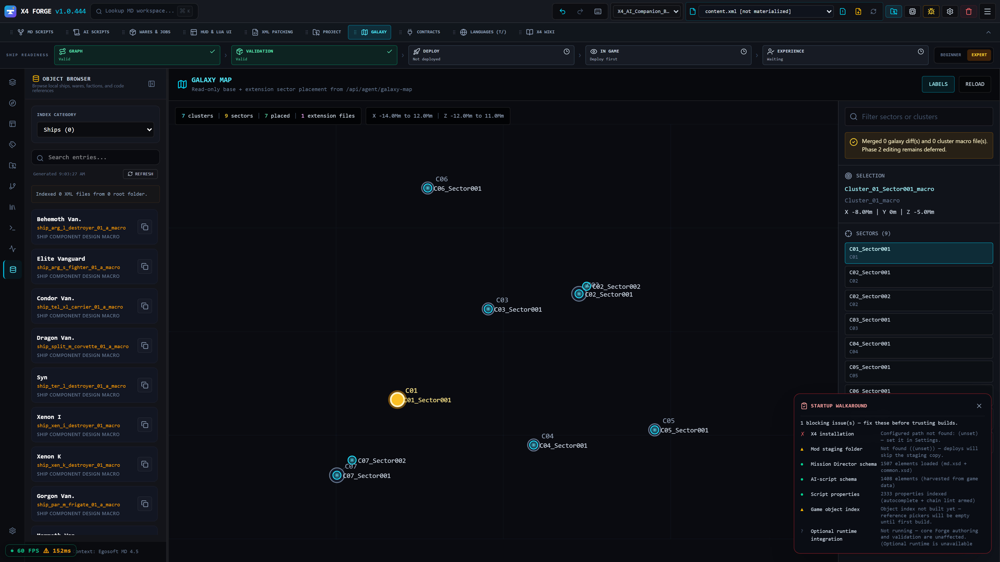
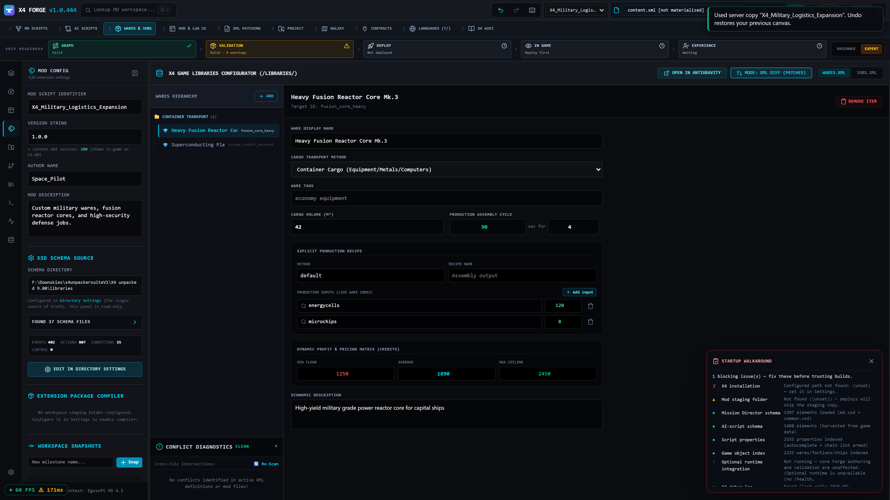
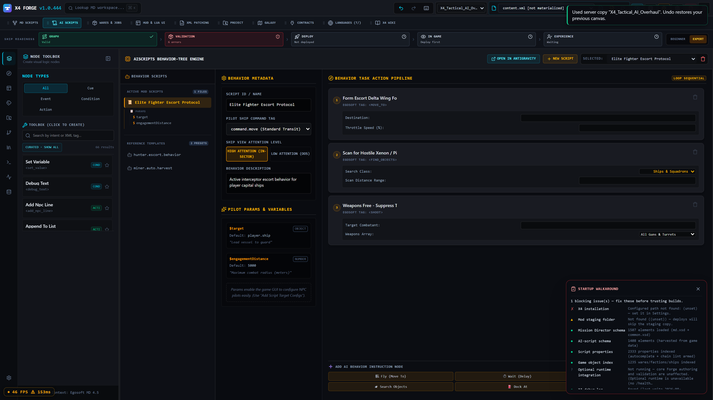
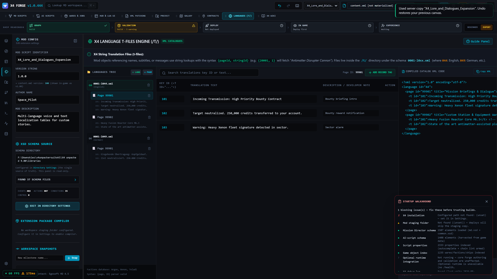
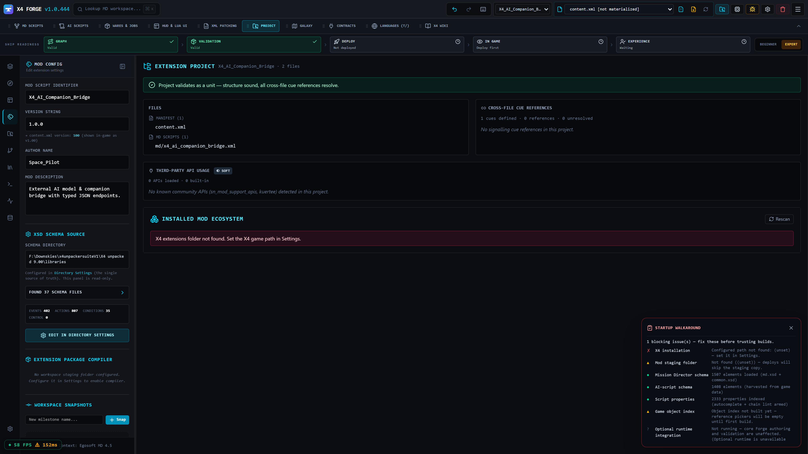

# X4 Forge Studio

**Build serious X4: Foundations mods in one local, X4-aware workspace.**

X4 Forge is a visual modding studio and VS Code-compatible extension for the full path from
authoring to evidence. It connects a navigable Mission Director graph with native XML editing,
X4 corpus and XSD intelligence, deterministic whole-project diagnostics, safe patching, and
guarded package and deploy workflows.

The result is fewer silent reference and selector failures, faster iteration, and a clear record
of what Forge checked before changes reach the game.

**Start here:** [install X4 Forge Studio from Open VSX](https://open-vsx.org/extension/x4forge/x4-forge-studio),
then run **X4 Forge: Open Studio** from your editor's Command Palette.

## One workflow, from idea to in-game evidence

1. **Configure** your X4 installation, reference/schema data, mod workspace, and deployment path.
2. **Author** visually in the Mission Director graph, edit the native XML directly, or combine
   both. Existing files stay visible and editable; the graph remains tied to its source.
3. **Validate** the complete project while you work. Inspect findings, their Why/provenance, and
   the proposed next action instead of debugging only the file currently open.
4. **Prepare** a package, inspect the generated artifacts, and preview deployment effects.
5. **Deploy** through guarded writes with verified backups and recovery protection.
6. **Run X4** and bring runtime evidence back to the source. X4 remains the final authority.

## Shipped capability pillars

### Visual Mission Director & Script Authoring

- Turn Mission Director cues, events, conditions, actions, branches, loops, signals, and sub-cues into a navigable graph.
- Inspect and edit the real XML at any point. Forge supports both graph-first and native, source-first workflows; it does not hide or remove the generated source.
- Import existing extensions as complete graph lanes, while preserving unsupported or extension-defined elements as localized raw XML at their original position.

### XML Patching & Diff Simulation

- Surgical XML patching workbench targeting real base-game, DLC, and extension files.
- Preview the effective document before and after a change, validate selectors, simulate every emitted operation, and keep the base file, candidate, revision, and generated patch aligned.

### Bulk XML Transforms Workbench

- Parameterized numeric and attribute transforms across hundreds of game files simultaneously.
- Preview diffs across all target files atomically before applying changes, with strict collision and selector checks.

### HUD & Lua UI 2D Canvas Designer

- Linter-first, source-backed X4 static checks use the configured corpus to catch supported engine-impact frame traps and other invalid UI layout assumptions.
- The preview path ports and reuses authoritative helper, widget, and Zekton inputs from the configured unpacked X4 corpus where supported; unsupported or no-geometry targets are refused rather than guessed.
- It is a bounded source preview, not a universal Lua renderer: unsupported or dynamic Lua is not rendered as verified geometry. A bounded generated menu has rendered in X4, but preview-to-game pixel parity remains unverified. **Not verified in game.**
- Drag-and-drop widget layout, styling, and automated Lua glue generation.

### External Integration Contracts & REST API Seam

- Connect external AI models, companion apps, and web services to X4 with typed JSON contracts.
- Auto-generates bidirectional `UI/<ID>_HTTP.LUA` and `MD/<ID>_HTTP.XML` integration code.

### Galaxy Map & Sector Navigator

- Interactive galaxy map with cluster/sector nodes, coordinate projection, macro details, and object indexing.
- Direct integration with reference corpus for macro and gate discovery.

### Wares & Jobs Data Configurator

- Custom ware definition, transport categories, production cycle inputs, and dynamic pricing matrices.
- Faction job quota and fleet spawning configuration.

### AI Scripts Behavior-Tree Engine

- Ship AI behavior builder with high-attention (in-sector) vs low-attention (OOS) protocols.
- Structured pilot parameters, variables, interrupt conditions, and task action pipelines (`<move_to>`, `<find_objects>`, `<shoot>`).

### Multi-Language T-Files Localization Workbench

- String catalog manager for voice lines, briefings, and UI text across all X4 language IDs (`0001-l044.xml`, `0001-l049.xml`, etc.).
- Page trees, developer notes, and live Egosoft-compliant XML compilation.

### Project Packaging & Release Center

- Whole-project validation ladder, dependency checking, and conflict analysis.
- One-click packaging for Nexus Mods (install-root ZIP) and Steam Workshop (CAT/DAT staging with preview metadata).

## The trust boundary

Forge is strong at making static structure, references, package contents, patch effects, and
deployment state inspectable. That is not the same as proving gameplay intent. Schema-valid code
can still behave incorrectly in X4; a cue may not fire, a menu may not open, or a mechanic may
not produce the result you intended.

Run the mod in X4 and inspect its runtime evidence. The game is the final authority, while Forge
helps connect that evidence back to the source, validation baseline, and deployment that produced it.

## Who it is for

- **New modders:** use the visual graph and Studio workflow while keeping the generated
  source available for learning and review.
- **Existing mod authors:** open a real extension, work directly in native XML or combine source
  edits with graph navigation, then validate the whole project before deployment.
- **Power users and release maintainers:** use patch simulation, bulk transforms, Extension Doctor,
  package preparation, deployment previews, recovery, and proof artifacts as one repeatable loop.

## Optional integrations

Multiple workspaces have server-owned identities, so validation, history, packaging, recovery,
and agent keys stay attached to the correct project. The extension can open a mod folder in the
IDE, create scoped agent keys, copy MCP configuration, refresh an agent brief, and generate a
proof artifact. These integrations are secondary to the Studio's own deterministic checks.

The optional AI Guide is off by default. If enabled, it uses providers and keys you configure to
propose project work; proposals remain visible, require explicit confirmation before apply, and
are still judged by deterministic Forge validation. Provider use can send requests over the
network and consume the budget configured for that provider.

## Start in three steps

1. Install X4 Forge Studio from [Open VSX](https://open-vsx.org/extension/x4forge/x4-forge-studio)
   in VS Code, Antigravity, or another compatible editor.
2. Open a trusted workspace, run **X4 Forge: Open Studio**, and configure the X4 installation,
   workspace, and reference/schema paths.
3. Create or load a mod, author in the graph or native editor, validate before the first package
   or deploy, then test the result in X4.

## Requirements, privacy, and limits

- Windows is the primary supported environment because X4 and the current deployment workflow are
  Windows-focused.
- Install Node.js. The extension runs the Forge engine locally and uses a real Node installation
  for its sidecar.
- Have X4: Foundations installed when you need game-backed reference data or deployment. Forge is
  a development tool; it does not supply X4.
- Use a trusted workspace. Forge compiles projects, writes local files, and can deploy into the
  game installation, so it stays disabled in untrusted workspaces.

The Forge backend runs on your machine over a protected local connection. Projects, game files,
validation data, credentials, and generated artifacts remain local during local workflows. The
optional AI path is different: requests go to the provider you configure and use your keys.

Forge is not an in-game replacement, an automatic release uploader, or an asset-modelling suite.
Static validation reduces avoidable failures; it does not replace running X4 and checking the
behaviour you intended.

## Support

For installation problems, reproducible validation failures, or feature requests, [open an issue
on GitHub](https://github.com/KennyG1990/X4_Forge/issues) with your editor, operating system, and
the smallest project or diagnostic that reproduces the problem.

Licensed under MIT.
